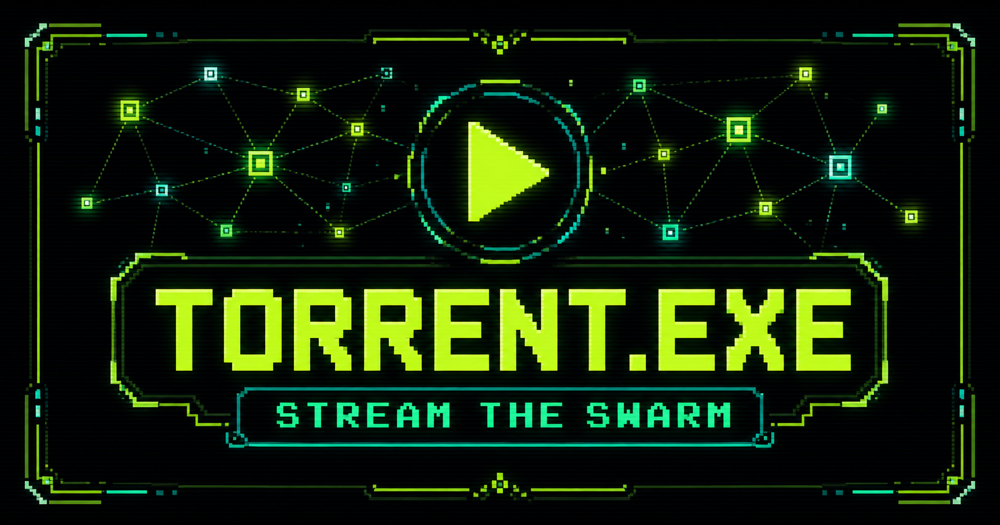
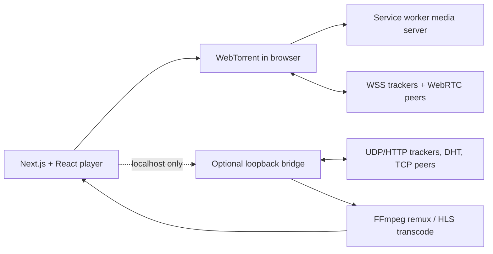

# NerdTorrentPlayer

<p align="center">
	
</p>

<p align="center">
	<strong>Local-first torrent streaming with browser WebRTC, native swarm support, and a real media player.</strong>
</p>

<p align="center">
	<a href="https://nerdtorrentplayer.vercel.app">Live demo</a> ·
	<a href="#quick-start">Quick start</a> ·
	<a href="#browser-vs-native-playback">Browser vs native playback</a> ·
	<a href="#architecture">Architecture</a> ·
	<a href="CONTRIBUTING.md">Contributing</a> ·
	<a href="SECURITY.md">Security</a>
</p>

NerdTorrentPlayer is a responsive torrent media console for selecting files,
streaming supported media early, managing captions, continuing where you left
off, and understanding exactly what the swarm is doing. It works as a hosted
browser app for WebTorrent-compatible sources, with an optional private local
bridge that unlocks conventional BitTorrent swarms and FFmpeg conversion.

## Why It Exists

Most torrent interfaces treat playback, transport health, container support,
and resume state as separate problems. NerdTorrentPlayer keeps them in one
focused workflow:

1. Paste a magnet or open a `.torrent` file.
2. Inspect the media manifest and choose the file to prioritize.
3. Stream, switch episodes, add captions, and resume locally.
4. See the real peer, tracker, transfer, and buffer state instead of a vague
	 spinner.

## Features

| Playback | Swarm | Library | Player |
| --- | --- | --- | --- |
| Piece-prioritized streaming | WSS/WebRTC browser transport | Private IndexedDB library | Vidstack controls, PiP, fullscreen |
| Native remux/transcode path | UDP, HTTP tracker, DHT, TCP via localhost | Resume records per media file | Captions and subtitle timing controls |
| Browser-safe HLS conversion | Tracker and peer diagnostics | Selected-file memory | Next playable file / episode |
| MP4, M4V, WebM direct delivery | Explicit compatibility feedback | No application-server media storage | Responsive desktop and mobile UI |

## Quick Start

**Requirements:** Node.js 22.13+ and FFmpeg for native remux/transcode/HLS.

```bash
git clone https://github.com/GautamVhavle/NerdTorrentPlayer.git
cd NerdTorrentPlayer
npm install
npm run dev
```

Open [http://localhost:3000](http://localhost:3000).

`npm run dev` starts both parts of the local stack:

| Service | Address | Purpose |
| --- | --- | --- |
| Web application | `http://localhost:3000` | Interface, browser WebTorrent, local library |
| Native bridge | `http://127.0.0.1:41780` | Conventional peers, FFmpeg, local media delivery |

For browser-only development:

```bash
npm run dev:web
```

To run only the native bridge:

```bash
npm run bridge
```

## Browser Vs Native Playback

This distinction matters. WebTorrent in a browser is **WebRTC-only**; it cannot
open BitTorrent TCP/uTP connections or UDP tracker connections.

| Capability | Hosted app / Vercel | Local app with bridge |
| --- | --- | --- |
| WebRTC peers and WSS trackers | Yes | Yes |
| HTTP web seeds | Yes | Yes |
| Conventional TCP peers | No | Yes |
| UDP/HTTP trackers and DHT | No | Yes |
| MKV/HEVC conversion via FFmpeg | No | Yes |
| Browser-safe HLS transcode | No | Yes |
| Broad conventional-torrent support | No | Yes |

The [live Vercel app](https://nerdtorrentplayer.vercel.app) is a frontend-only
deployment. A pasted torrent works there only when a WebRTC/WebTorrent-capable
peer, WSS tracker route with web peers, or an HTTP web seed is available.

The local bridge is intentionally not public infrastructure. It binds only to
loopback, validates host and origin boundaries, and issues random session
capability tokens. It is the reliable option for conventional torrents.

## Playback Notes

- Direct browser playback is best with supported MP4/M4V/WebM media.
- For MKV, HEVC, or incompatible audio codecs, the local bridge can remux or
	transcode through FFmpeg.
- HLS output is a retained, growing local archive with H.264 video and AAC
	audio. Generated segments remain available until the session closes or its
	bounded local disk budget is reached.
- The player intentionally does not promise arbitrary seeking when the torrent
	pieces or converted media for that time have not arrived yet.

## Architecture



## Development

```bash
npm run lint              # ESLint
npm run test:bridge       # Bridge security, range, FFmpeg, and HLS tests
npm run test:live-torrent # Networked WebTorrent smoke test
npm run build             # Vinext build
npm run build:vercel      # Vercel production build
npm test                  # Build plus all Node tests
```

The live torrent smoke test requires network access and uses the official
public-domain Sintel torrent.

## Deploying The Frontend

```bash
npm run build:vercel
npx vercel --prod
```

Vercel hosts the frontend. It does not host a persistent hybrid torrent client,
UDP sockets, FFmpeg, or an HLS segment server. Hosting those capabilities for
arbitrary conventional torrents requires a separate always-on Node/container or
desktop runtime, along with appropriate bandwidth, abuse, and legal controls.

## Privacy And Security

- Swarm peers can see the public IP address used for the torrent connection.
- Saved magnets, `.torrent` bytes, library entries, and resume records stay in
	the user’s browser storage unless the user exports them.
- The application server does not receive, store, or transcode torrent media.
- The local bridge accepts only trusted loopback origins and protects its
	sessions with random capability tokens.

## Native Bridge

For environment variables, API endpoints, and the bridge security model, see
[backend/bridge/README.md](backend/bridge/README.md).

## Stack

- Next.js 16, React 19, TypeScript
- WebTorrent and service-worker media streaming
- Vidstack and hls.js playback provider
- FFmpeg-backed local remux, transcode, and HLS bridge
- Zustand, Motion, Drizzle, and Tailwind CSS
